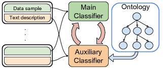
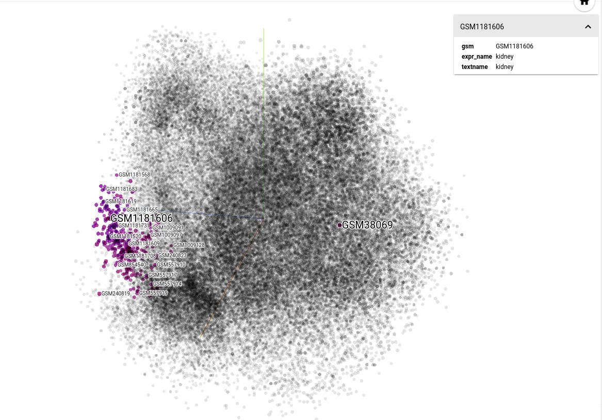

## Projects
* Deep Curation: a general approach for bootstrapping a curation task using only raw data with textual descriptions and a domain ontology.

* Data Embedding: View our gene embedding at [TensorFlow projector](http://projector.tensorflow.org/?config=http://homes.cs.washington.edu/~grechkin/proj/proj_scan_pca.json)

* Data Explorer: A preview version of data exploration tool is available [here](https://homes.cs.washington.edu/~grechkin/metageo/ver2/)

* [Wide-Open](https://wideopen.github.io/datawatch/): detecting overdue datasets in GEO and SRA.

## Data
* [UPC](https://upc) processed data used in Deep Curation project: [hdf5 file](https://drive.google.com/file/d/0B9HcMitQmCtjSDQ3WWdIX1luaEE/view?usp=sharing)
* Raw .CEL files obtained from GEO for processing: [here](https://drive.google.com/file/d/0B9HcMitQmCtjOTN1T3dWS3VpdlE/view?usp=sharing)

## Software
* [OBOParse.jl](https://github.com/maximsch2/OBOParse.jl): A [Julia](https://julialang.org) library for parsing ontologies in Open Biomedical Ontologies format.
* More will be available soon.

## People
* [Maxim Grechin](https://homes.cs.washington.edu/~grechkin/)
  PhD Student at Paul G. Allen School of Computer Science and Engineering, University of Washington
* [Hoifung Poon](https://www.microsoft.com/en-us/research/people/hoifung/)
  Researcher at Microsoft Research
* [Bill Howe](https://faculty.washington.edu/billhowe/)
  Associate Professor, Information School, University of Washington
